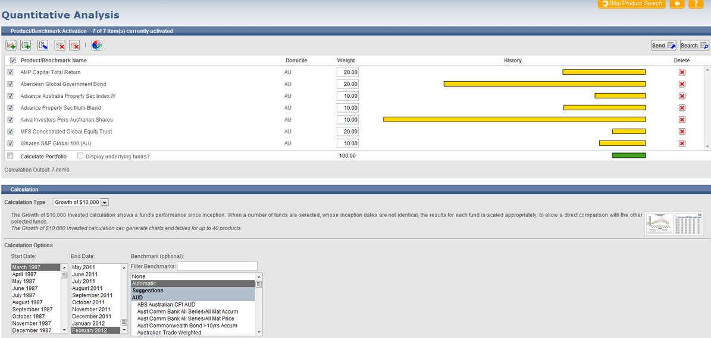

van Eyk Research
================

My role at van Eyk was software engineer/web developer, primarily for the financial research platform ‘iRate Online’.
At the time van Eyk were considered Australia's most respected financial research provider.
Clients and business relationships included BT, Coin (Macquarie), Oasis, OnePath, AMP, Count, Morningstar, Aspect Huntley, IRESS, FundData, Core Equity Services (CommSec), Bloomberg.

iRate Online
------------

### Shares section

### Quantitative Analysis

Fund and Share profiles
-----------------------

[Fund Profile - 14175 original design.pdf](<pdf/Fund Profile - 14175 original design.pdf>)

A significant part of my work involved the automated production of fund and share reports (product profiles).

Features included:
* PDF and HTML generation
* On demand and batch creation
* Caching
* Custom client branding and layouts
* Delivery via SOAP, FTP and HTTP

PDF files were generated using XSL-FO and Apache FOP:

https://en.wikipedia.org/wiki/XSL_Formatting_Objects

https://en.wikipedia.org/wiki/Formatting_Objects_Processor

https://github.com/apache/xmlgraphics-fop

All charts and graphics were done in SVG, so the reports had very high quality images with very small file sizes.

Share charts were produced with a custom engine I wrote myself; fund charts were from an engine written by one of my colleagues.

Share charts
------------

I wrote the charting engine for the SVG share charts seen in the screenshots and reports.
At the time (early 2000s) no mainstream browser had a working SVG implementation, the only option was a surprisingly feature-complete browser plugin from Adobe (Adobe SVG Viewer).
Our users were directed to install the plugin.

For the charts viewed on the website I added a simple zooming animation using SMIL and EcmaScript.

There are working examples of the animated charts in the [shares](shares/) folder, however GitHub's CSP header currently prevents the scripts from running when clicked through directly (until I find a workaround):

	content-security-policy: default-src 'none'; style-src 'unsafe-inline'; sandbox

If you trust me, you can download these and run them locally in a modern browser.
I had to clean up the SVG a little bit for modern browser compliance, but they're basically as presented back in the day.

Ref:
https://en.wikipedia.org/wiki/Synchronized_Multimedia_Integration_Language

Technologies
------------
* ColdFusion
* HTML
* JavaScript
* CSS
* SVG
* SMIL
* XSL-FO
* Apache FOP
* Java
* Windows Server
* IIS
* HTTPS
* Microsoft SQL Server
* SOAP
* Eclipse
* Jira, Confluence etc (on-prem and OnDemand)
* Ubuntu
* VMWare
* Subversion
* Visual Sourcesafe

